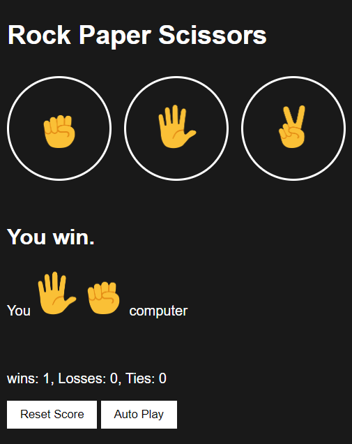

# [Rock Paper Scissors Game](https://nitinsingh0219.github.io/rock-paper-scissors.github.io/)

## Demo

## Introduction
This is a simple web-based implementation of the classic game "Rock Paper Scissors." In this game, the player competes against the computer in a series of rounds, choosing between rock, paper, or scissors. The winner of each round is determined based on the rules of the game: rock beats scissors, scissors beat paper, and paper beats rock.

## How to Play
The game interface will be displayed, showing options for Rock, Paper, and Scissors.
Click on the button corresponding to your chosen move (Rock, Paper, or Scissors).
After making your choice, the computer will randomly select its move, and the winner of the round will be announced on the screen.
The game will continue for a predefined number of rounds or until you decide to quit.
After each round the result will be displayed, showing the number of rounds you won, lost, and the number of ties.
### Game Rules
Rock beats Scissors
Scissors beat Paper
Paper beats Rock
### Technical Requirements
The game is built using HTML, CSS, and JavaScript. It requires a modern web browser that supports these technologies.

## File Structure
The repository contains the following files:

index.html: The main HTML file that defines the game interface.
style.css: The CSS file for styling the game interface.
script.js: The JavaScript file containing the game logic.
README.md: The readme file providing information about the game and how to play.
(Optional) Additional file images.
### How the Game Works
The game uses JavaScript to handle user input and generate the computer's move randomly. The game logic is implemented in the script.js file, and the HTML and CSS files handle the game's visual representation.

## Acknowledgments
This simple web development Rock Paper Scissors game was created for educational purposes and was inspired by the classic hand game loved by many.

Have fun playing the game! If you encounter any issues or have suggestions for improvement, feel free to open an issue or pull request on the project repository. Enjoy!
